# Facial Emotion Regonition using Deep Learning

---

## Introduction

This project aims to classify the emotion on a person's face into one of **eight categories**, using deep convolutional neural networks and generative adversarial networks. The model is trained on the **AffectNet** dataset. This dataset consists of 291,651, 224x224 sized face images with **eight emotions** - anger, contempt, disgust, fear, happy, neutral, sad and surprised.

---

## Data Collection
There are several datasets publicly available for use in facial expression detection. I decided to utilize the [AffectNet](http://mohammadmahoor.com/affectnet/) dataset. 

The major advantage of AffectNet is the size, over 290,000 images. The disadvantage that appears to exist in most FER datasets, but in particular within AffectNet, is that there are a relatively high number of mislabelled images. The labelling process for facial emotions is not trivial, as often it is not really clear the emotion the subject is experiencing, just based upon their facial expression. Additionally, many photos of actors' reproducing a particular emotion are not great representations, depending on their skill level at acting. 
 
For the AffectNet dataset, this means that the [stat-of-the-art classifier]('https://paperswithcode.com/sota/facial-expression-recognition-on-affectnet') is currently 62.425% accuracy (using all 8 emotions in the dataset).

For the code in this project, the images are presumed to be contained in the data folder in the root directory. For reproduction, please download the dataset by submitting a request [here]('http://mohammadmahoor.com/affectnet-request-form/').

---

## Dependencies

* Python 3.8, [Tensorflow 2.8](https://www.tensorflow.org/), and Tensorflow Addons
* To install the required packages, run `pip install -r requirements.txt`.

## Basic Usage

The repository is currently compatible with `tensorflow-2.8` and makes use of the Keras API using the `tensorflow.keras` library.

* First, clone the repository and enter the folder

```bash
git clone https://github.com/jeffreykthomas/emotion-recognition.git
cd emotion-recognition
```
* If you want to train the first model, use:  

```bash
python3 -m training_models.emotion_recognition_training -size 64 --classes 8 --epochs 200
```

* The results I obtained from that training run are below:

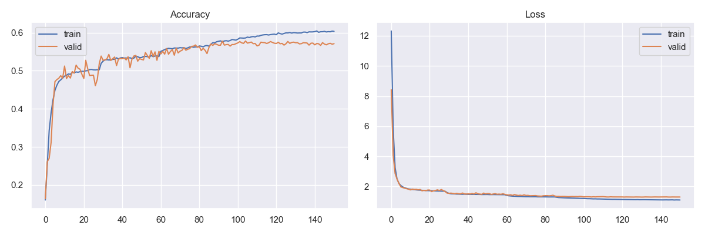
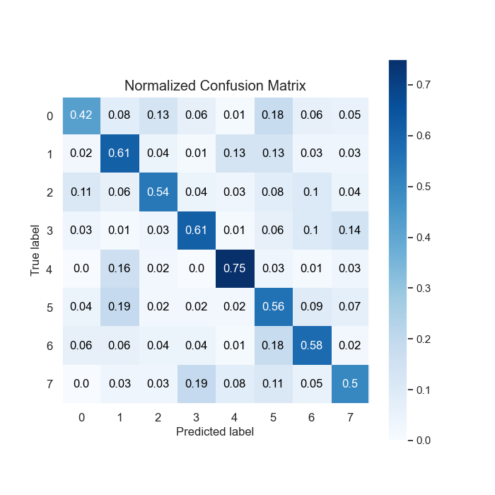
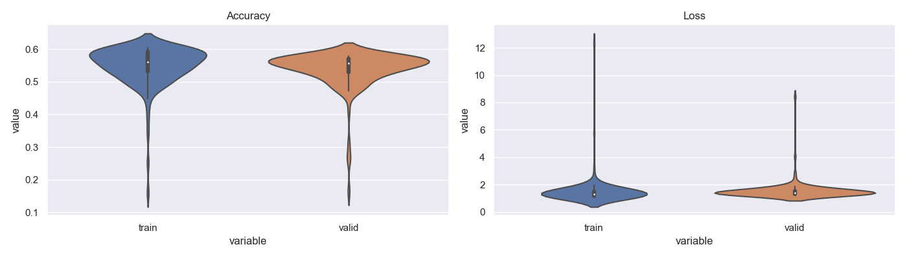
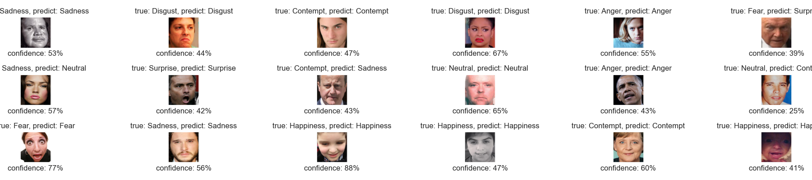

* Next, thinking of ways to improve the training, we explored the world of GANS, and found that a [Cycle Gan]('https://keras.io/examples/generative/cyclegan/') can be the most efficient to train and utilize for the purposes of increasing the accuracy of an emotion recognizer, with the added potential of increasing FER data.
* To train the cycle gan, use:

```bash
python3 -m training_models.cyclegan --emotion1 'Happiness' --emotion2 'Sadness'
```

* Some examples of images created using a cycle gan trained for several hundred epochs:
<div align="center">
<table style="margin: 0 auto">
<tr>
<th> Original </th>
<th> Transformed </th>
<th></th>
<th> Original </th>
<th> Transformed </th>
</tr>
<tr>
<td style="text-align: center;">


<p style="margin-top: -15px;">Neutral</p>
</td>
<td style="text-align: center;">


<p style="margin-top: -15px;">Angry</p>
</td>
<td></td>
<td style="text-align: center;">


<p style="margin-top: -15px;">Neutral</p>
</td>
<td style="text-align: center;">


<p style="margin-top: -15px;">Angry</p>
</td>
</tr>
<tr>
<td style="text-align: center;">


<p style="margin-top: -15px;">Neutral</p>
</td>
<td style="text-align: center;">


<p style="margin-top: -15px;">Angry</p>
</td>
<td></td>
<td style="text-align: center;">


<p style="margin-top: -15px;">Neutral</p>
</td>
<td style="text-align: center;">


<p style="margin-top: -15px;">Angry</p>
</td>
</tr>
<tr>
<td style="text-align: center;">


<p style="margin-top: -15px;">Happy</p>
</td>
<td style="text-align: center;">


<p style="margin-top: -15px;">Contempt</p>
</td>
<td></td>
<td style="text-align: center;">


<p style="margin-top: -15px;">Happy</p>
</td>
<td style="text-align: center;">


<p style="margin-top: -15px;">Contempt</p>
</td>
</tr>
<tr>
<td style="text-align: center;">


<p style="margin-top: -15px;">Happy</p>
</td>
<td style="text-align: center;">


<p style="margin-top: -15px;">Fear</p>
</td>
<td></td>
<td style="text-align: center;">


<p style="margin-top: -15px;">Happy</p>
</td>
<td style="text-align: center;">


<p style="margin-top: -15px;">Fear</p>
</td>
</tr>

<tr>
<td style="text-align: center;">


<p style="margin-top: -15px;">Happy</p>
</td>
<td style="text-align: center;">


<p style="margin-top: -15px;">Sad</p>
</td>
<td></td>
<td style="text-align: center;">


<p style="margin-top: -15px;">Happy</p>
</td>
<td style="text-align: center;">


<p style="margin-top: -15px;">Sad</p>
</td>
</tr>
<tr>
<td style="text-align: center;">


<p style="margin-top: -15px;">Neutral</p>
</td>
<td style="text-align: center;">


<p style="margin-top: -15px;">Surprised</p>
</td>
<td></td>
<td style="text-align: center;">


<p style="margin-top: -15px;">Neutral</p>
</td>
<td style="text-align: center;">


<p style="margin-top: -15px;">Surprised</p>
</td>
</tr>

</table>
</div>

* One thing I noticed during that process is that if the label for an image seemed somewhat ambiguous, the resulting generated image would be transformed a lot less (it would look a lot like the original).

<div align="center">
<table style="margin: 0 auto">
<tr>
<th> Original </th>
<th> Transformed </th>
<th></th>
<th> Original </th>
<th> Transformed </th>
</tr>
<tr>
<td style="text-align: center;">


<p style="margin-top: -15px;">Happy</p>
</td>
<td style="text-align: center;">


<p style="margin-top: -15px;">Fear</p>
</td>
<td></td>
<td style="text-align: center;">


<p style="margin-top: -15px;">Happy</p>
</td>
<td style="text-align: center;">


<p style="margin-top: -15px;">Sad</p>
</td>
</tr>
<tr>
<td style="text-align: center;">


<p style="margin-top: -15px;">Happy</p>
</td>
<td style="text-align: center;">


<p style="margin-top: -15px;">Sad</p>
</td>
<td></td>
<td style="text-align: center;">


<p style="margin-top: -15px;">Happy</p>
</td>
<td style="text-align: center;">


<p style="margin-top: -15px;">Disgust</p>
</td>
</tr>

</table>
</div>

## Look for ambiguous Labels
* Using the hypothesis that the cycle gan doesn't transform ambiguously labeled images as much, to use the trained gan models to look for images with ambiguous labels, run:
```bash
python3 -m eval_tools.eval_image_transformation
```
* This script uses the structural similarity module from skimage.metrics to check how similar an image is to its transformed image. I ended up using a threshold of 0.85 as the measure of structural similarity needed to be in order to be classified as 'ambiguous'.
## Training with ambiguous labels filtered out

* To train the recognizer model with only images classified as not 'ambiguous', run:
```bash
python3 -m training_models.emotion_recognition_training -size 64 --classes 8 --epochs 200 --reduced True
```
* The results I obtained from that training run are below, around 3% higher accuracy on the validation set:

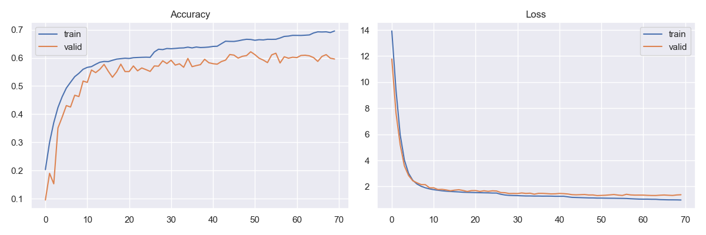
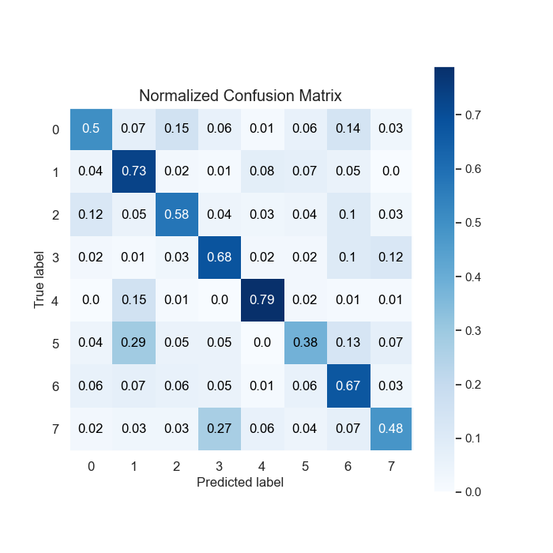
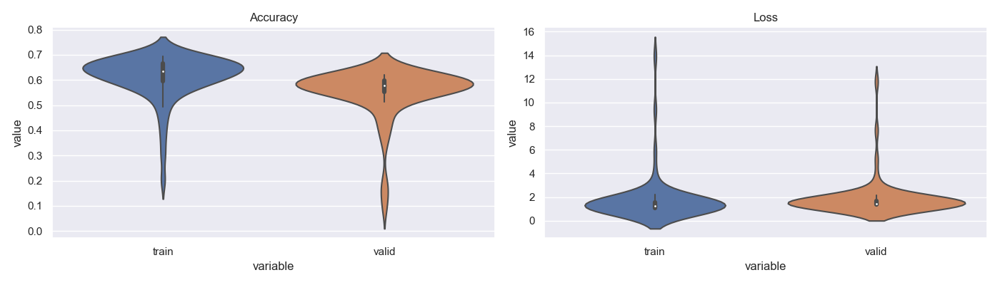
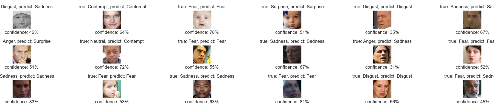
## Training with ambiguous labels filtered out & additional generated images

* To train the recognizer model with non 'ambiguous' original images, plus 18,000 generated images, run:
```bash
python3 -m training_models.emotion_recognition_training -size 64 --classes 8 --epochs 200 --reduced True --augmented True
```
* The results I obtained from that training run are below, an additional 2% higher accuracy on the validation set, for a total of 5%, when compared to the original training run:

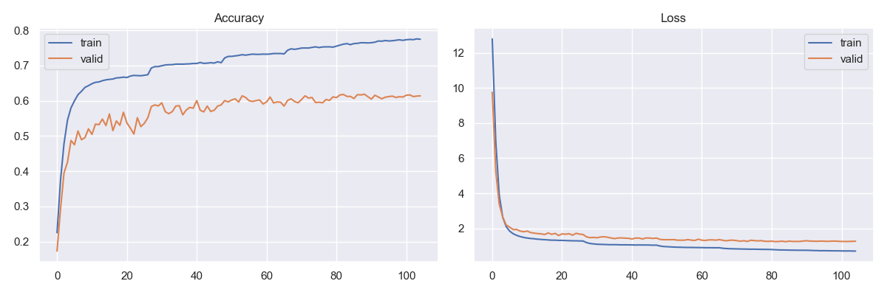
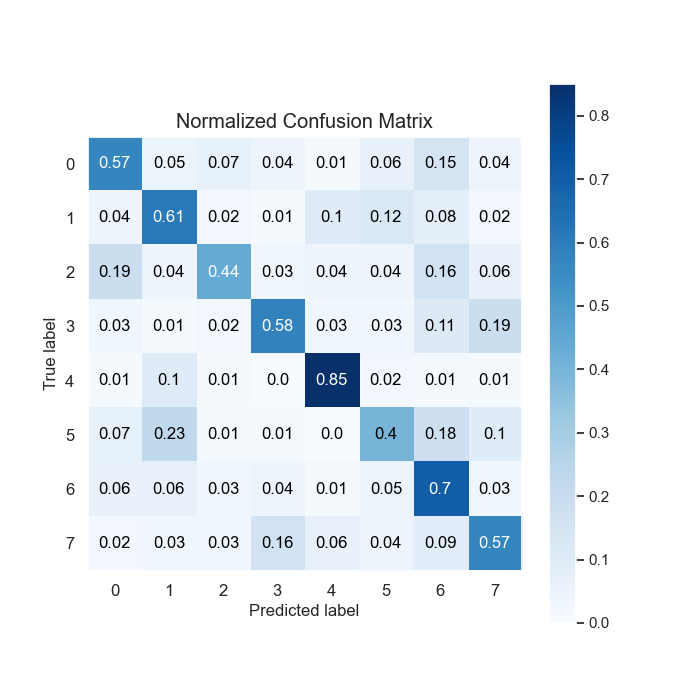
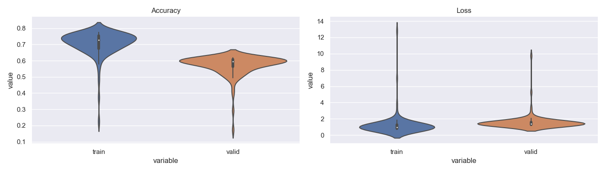
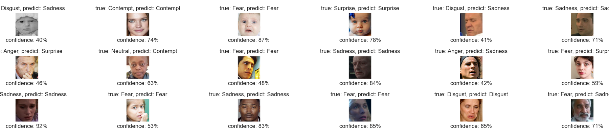

## References

* "Challenges in Representation Learning: A report on three machine learning contests." I Goodfellow, D Erhan, PL Carrier, A Courville, M Mirza, B
   Hamner, W Cukierski, Y Tang, DH Lee, Y Zhou, C Ramaiah, F Feng, R Li,  
   X Wang, D Athanasakis, J Shawe-Taylor, M Milakov, J Park, R Ionescu,
   M Popescu, C Grozea, J Bergstra, J Xie, L Romaszko, B Xu, Z Chuang, and
   Y. Bengio. arXiv 2013.
* "Unpaired Image-to-Image Translation using Cycle-Consistent Adversarial Networks" Jun-Yan Zhu∗ Taesung Park∗ Phillip Isola Alexei A. Efros, Berkeley AI Research (BAIR) laboratory, UC Berkeley
