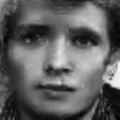

# Facial Emotion Regonition using Deep Learning

---

## Introduction

This project aims to classify the emotion on a person's face into one of **eight categories**, using deep convolutional neural networks and generative adversarial networks. The model is trained on the **AffectNet** dataset. This dataset consists of 291,651, 224x224 sized face images with **eight emotions** - anger, contempt, disgust, fear, happy, neutral, sad and surprised.

---

## Data Collection
There are several datasets publicly available for use in facial expression detection. I decided to utilize the [AffectNet](http://mohammadmahoor.com/affectnet/) dataset. 

The major advantage of AffectNet is the size, over 290,000 images. The disadvantage that appears to exist in most FER datasets, but in particular within AffectNet, is that there are a relatively high number of mislabelled images. The labelling process for facial emotions is not trivial, as often it is not really clear the emotion the subject is experiencing, just based upon their facial expression. Additionally, many photos of actors' reproducing a particular emotion are not great representations, depending on their skill level at acting. 
 
For the AffectNet dataset, this means that the [state-of-the-art classifier](https://paperswithcode.com/sota/facial-expression-recognition-on-affectnet) is currently 62.425% accuracy (using all 8 emotions in the dataset).

For the code in this project, the images are presumed to be contained in the `data` folder in the root directory. For reproduction, please download the dataset by submitting a request [here]('http://mohammadmahoor.com/affectnet-request-form/').

---

## Dependencies

* Python 3.8, [Tensorflow 2.8](https://www.tensorflow.org/), and Tensorflow Addons
* To install the required packages, run `pip install -r requirements.txt`.

## Basic Training

The repository is currently compatible with `tensorflow-2.8` and makes use of the Keras API using the `tensorflow.keras` library.

* First, clone the repository and switch to the folder

```bash
git clone https://github.com/jeffreykthomas/emotion-recognition.git
cd emotion-recognition
```
* If you want to train the first model, use:  

```bash
python3 -m training_models.emotion_recognition_training -size 128 --classes 8 --epochs 200
```

* The results I obtained from that training run are below:


## Training with GANs
* Next, thinking of ways to improve the training, we explored the world of GANS. Within the [keras library of examples](https://keras.io/examples/generative), I tried to train an AdaGan, a StyleGan, and a DCGan. All had varying levels of effecitveness. But from those first attempts, the Conditional Gan produced the most realistic images of faces, that were somewhat representative of the emotion they were meant to portray. 
* To run training on the conditional gan with AffectNet, use:

```bash
python3 -m training_models.conditional_gan 
```

While the images looked better than some of the other attempted GANs, the results weren't good enough representations to move the needle much for improving the emotion recognition model. Below are some examples of faces generated from a random latent variable:

<div align="center">
<table style="margin: 0 auto">

<tr>
<td style="text-align: center;">


<p style="margin-top: -15px;">Angry</p>
</td>
<td style="text-align: center;">


<p style="margin-top: -15px;">Disgust</p>
</td>

<td style="text-align: center;">


<p style="margin-top: -15px;">Fear</p>
</td>

</tr>
<tr>
<td style="text-align: center;">


<p style="margin-top: -15px;">Happy</p>
</td>
<td style="text-align: center;">


<p style="margin-top: -15px;">Happy</p>
</td>
<td style="text-align: center;">


<p style="margin-top: -15px;">Neutral</p>
</td>
</tr>

<tr>
<td style="text-align: center;">


<p style="margin-top: -15px;">Neutral</p>
</td>
<td style="text-align: center;">


<p style="margin-top: -15px;">Sad</p>
</td>
<td style="text-align: center;">


<p style="margin-top: -15px;">Surprise</p>
</td>
</tr>

</table>
</div>

## The CycleGan
* Ultimately, we found that a [Cycle Gan](https://keras.io/examples/generative/cyclegan/) can be the most efficient to train and utilize for the purposes of increasing the accuracy of an emotion recognizer, with the added potential of increasing FER data.
* To train the cycle gan, use:

```bash
python3 -m training_models.cyclegan --emotion1 'Happiness' --emotion2 'Sadness'
```

* Some examples of images created using a cycle gan trained for several hundred epochs:
<div align="center">
<table style="margin: 0 auto">
<tr>
<th> Original </th>
<th> Transformed </th>
<th></th>
<th> Original </th>
<th> Transformed </th>
</tr>
<tr>
<td style="text-align: center;">


<p style="margin-top: -15px;">Neutral</p>
</td>
<td style="text-align: center;">


<p style="margin-top: -15px;">Angry</p>
</td>
<td></td>
<td style="text-align: center;">


<p style="margin-top: -15px;">Neutral</p>
</td>
<td style="text-align: center;">


<p style="margin-top: -15px;">Angry</p>
</td>
</tr>
<tr>
<td style="text-align: center;">


<p style="margin-top: -15px;">Happy</p>
</td>
<td style="text-align: center;">


<p style="margin-top: -15px;">Contempt</p>
</td>
<td></td>
<td style="text-align: center;">


<p style="margin-top: -15px;">Happy</p>
</td>
<td style="text-align: center;">


<p style="margin-top: -15px;">Contempt</p>
</td>
</tr>
<tr>
<td style="text-align: center;">


<p style="margin-top: -15px;">Happy</p>
</td>
<td style="text-align: center;">


<p style="margin-top: -15px;">Disgust</p>
</td>
<td></td>
<td style="text-align: center;">


<p style="margin-top: -15px;">Happy</p>
</td>
<td style="text-align: center;">


<p style="margin-top: -15px;">Disgust</p>
</td>
</tr>
<tr>
<td style="text-align: center;">


<p style="margin-top: -15px;">Happy</p>
</td>
<td style="text-align: center;">


<p style="margin-top: -15px;">Fear</p>
</td>
<td></td>
<td style="text-align: center;">


<p style="margin-top: -15px;">Happy</p>
</td>
<td style="text-align: center;">


<p style="margin-top: -15px;">Fear</p>
</td>
</tr>

<tr>
<td style="text-align: center;">


<p style="margin-top: -15px;">Sad</p>
</td>
<td style="text-align: center;">


<p style="margin-top: -15px;">Happy</p>
</td>
<td></td>
<td style="text-align: center;">


<p style="margin-top: -15px;">Sad</p>
</td>
<td style="text-align: center;">


<p style="margin-top: -15px;">Happy</p>
</td>
</tr>
<tr>
<td style="text-align: center;">


<p style="margin-top: -15px;">Anger</p>
</td>
<td style="text-align: center;">


<p style="margin-top: -15px;">Neutral</p>
</td>
<td></td>
<td style="text-align: center;">


<p style="margin-top: -15px;">Anger</p>
</td>
<td style="text-align: center;">


<p style="margin-top: -15px;">Neutral</p>
</td>
</tr>
<tr>
<td style="text-align: center;">


<p style="margin-top: -15px;">Happy</p>
</td>
<td style="text-align: center;">


<p style="margin-top: -15px;">Sad</p>
</td>
<td></td>
<td style="text-align: center;">


<p style="margin-top: -15px;">Happy</p>
</td>
<td style="text-align: center;">


<p style="margin-top: -15px;">Sad</p>
</td>
</tr>
<tr>
<td style="text-align: center;">


<p style="margin-top: -15px;">Neutral</p>
</td>
<td style="text-align: center;">


<p style="margin-top: -15px;">Surprise</p>
</td>
<td></td>
<td style="text-align: center;">


<p style="margin-top: -15px;">Neutral</p>
</td>
<td style="text-align: center;">


<p style="margin-top: -15px;">Surprise</p>
</td>
</tr>
</table>
</div>

* Using the emotion recognition model to predict the emotions of the generated cyclegan images showed that they were classified correctly at a high rate:


* One thing I noticed during that process is that if the label for an image seemed somewhat ambiguous, the resulting generated image would be transformed a lot less (it would look a lot like the original).

<div align="center">
<table style="margin: 0 auto">
<tr>
<th> Original </th>
<th> Transformed </th>
<th></th>
<th> Original </th>
<th> Transformed </th>
</tr>

<tr>
<td style="text-align: center;">


<p style="margin-top: -15px;">Happy</p>
</td>
<td style="text-align: center;">


<p style="margin-top: -15px;">Disgust</p>
</td>
<td></td>
<td style="text-align: center;">


<p style="margin-top: -15px;">Neutral</p>
</td>
<td style="text-align: center;">


<p style="margin-top: -15px;">Anger</p>
</td>
</tr>
<tr>
<td style="text-align: center;">


<p style="margin-top: -15px;">Neutral</p>
</td>
<td style="text-align: center;">


<p style="margin-top: -15px;">Surprise</p>
</td>
<td></td>
<td style="text-align: center;">


<p style="margin-top: -15px;">Happy</p>
</td>
<td style="text-align: center;">


<p style="margin-top: -15px;">Sad</p>
</td>
</tr>

</table>
</div>

## Choosing the best GAN training weights
* During my training runs I saved the weights at the end of each epoch. To find the best weights for each run, I used the emotion recognizer model to find which weights produced the hightest percentage results for the transformed images. To replicate, run:

```bash
python3 -m eval_tools.eval_gan_performance
```

## Look for ambiguous Labels
* Using the hypothesis that the cycle gan doesn't transform ambiguously labeled images as much, to use the trained gan models to look for images with ambiguous labels, run:
```bash
python3 -m eval_tools.eval_image_transformation
```
* This script uses the structural similarity module from skimage.metrics to check how similar an image is to its transformed image. I ended up using a threshold of 0.85 as the measure of structural similarity needed to be in order to be classified as 'ambiguous'.
## Training with ambiguous labels filtered out

* To train the recognizer model with only images classified as not 'ambiguous', run:
```bash
python3 -m training_models.emotion_recognition_training -size 128 --classes 8 --epochs 200 --reduced True
```
* The results I obtained from that training run are below, close to 3% higher accuracy on the validation set:


* The results using the ambiguous filter for 7 classes was even higher, 67%, which is higher than the state-of-the-art models [reported here](https://paperswithcode.com/sota/facial-expression-recognition-on-affectnet).


## Training with ambiguous labels filtered out & additional generated images

* To train the recognizer model with non 'ambiguous' original images, plus 20,000 generated images, run:
```bash
python3 -m training_models.emotion_recognition_training -size 128 --classes 8 --epochs 200 --reduced True --augmented True
```
* The results I obtained from that training run are below, and accuracy of 62.15%, an additional 2% higher accuracy on the validation set, for a total of 5%, when compared to the original training run. This result is just slightly off the highest report of 62.425% (though I also filtered ambiguous images out of the validation set):


## Web App Production Pipeline

Once the best weights have been identified, use the following steps to prepare to deploy the models. To skip the training steps, [go here](https://drive.google.com/file/d/13IPttGQbn06Upkdh51IBqjmLGve7ZFx8/view?usp=sharing) to download weights from my training, plus the face detection weights, and move them to the `public` folder of the web app.
* First run the following code to prepare the models:
```bash
python3 -m production_pipeline.convert_weights_to_saved_model
```

* Next, to convert the models to javascript for deployment on the web, run:
```bash
python3 -m production_pipeline.convert_models_to_js
```

* There are many options for running and hosting websites. For this project, I used Vue 3 as the framework for the app, and firebase for hosting. If you want to use Vue, start a project by following the steps [here]('https://cli.vuejs.org/guide/creating-a-project.html')

```bash
npm install -g @vue/cli
```

* Then, in the appropriate folder, choosing the default vue3 options:

```bash
vue create web-app
```

* Lastly, for the style dependency, by [mdbootstrap](https://mdbootstrap.com/), and the [package containing tensorflow and face detection](https://github.com/vladmandic/face-api) (vladmandic package includes an updated version of tensorflowjs, whereas the main fork does not) install the following in the web-app root directory:

```bash
vue add mdb5
npm i @vladmandic/face-api 
```

* Then copy component `App.vue` and `main.js` in the `src` folder, and `EmotionRecognition.vue`, `Index.vue`, into the `components` folder of you project and run:
```bash
npm run serve 
```

* The running app is located at [emotiondetection.app](https://emotiondetection.app)

## References
* "Challenges in Representation Learning: A report on three machine learning contests." I Goodfellow, D Erhan, PL Carrier, A Courville, M Mirza, B
   Hamner, W Cukierski, Y Tang, DH Lee, Y Zhou, C Ramaiah, F Feng, R Li,  
   X Wang, D Athanasakis, J Shawe-Taylor, M Milakov, J Park, R Ionescu,
   M Popescu, C Grozea, J Bergstra, J Xie, L Romaszko, B Xu, Z Chuang, and
   Y. Bengio. arXiv 2013.
* "Unpaired Image-to-Image Translation using Cycle-Consistent Adversarial Networks" Jun-Yan Zhu∗ Taesung Park∗ Phillip Isola Alexei A. Efros, Berkeley AI Research (BAIR) laboratory, UC Berkeley
* 
